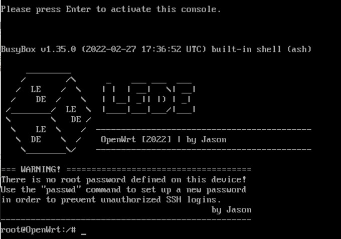

  

### 介绍 
- HDMI静默开机回车进入BusyBox指令
- [脚本新增TG跟Wechat推送说明](other/bot.md)
- 借助 GitHub Actions 的 OpenWrt 在线集成自动编译.
- 新增X86 5.15内核跟Dockerman，x86 ~~5.10内核~~，R4S内核5.15
1. 登录地址：`192.168.1.1`
2. 登录帐号：`root`
3. 登录密码：`无`

  
### 下载
- [Releases](https://github.com/Jason6111/OpenWrt_Personal/releases)
- [Tags](https://github.com/Jason6111/OpenWrt_Personal/tags)  

### 打赏 
如果你觉得此项目对你有帮助，可以捐助，以鼓励项目能持续发展，更加完善  

### 感谢
- 感谢[P3TERX](https://github.com/P3TERX/Actions-OpenWrt) 脚本。  
- 感谢[Lean](https://github.com/coolsnowwolf/lede) 源码。  
- 感谢[jerrykuku](https://github.com/jerrykuku) argon主题。 
